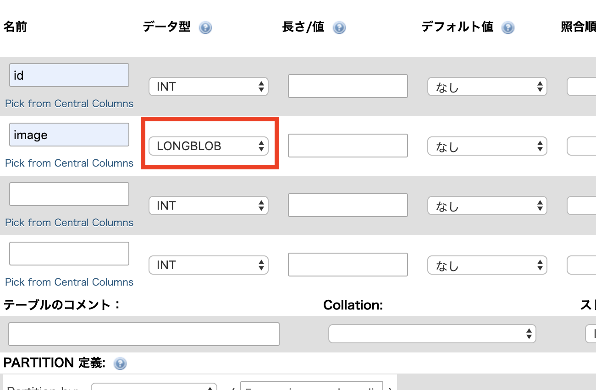

# PHP＋MySQLで画像をアップロードする方法

## データベース・テーブルを作成する
1. 任意のデータベースを作成する
2. テーブルを作成する
3. 画像データを保存するカラムを以下のように設定する  
データ型：LongBlob
	

## 画像をアップロードするFormを作成する
1. formタグに`enctype="multipart/form-data"`を設定
2. `input type="file"`を追加
		
	```HTML
	<form method="POST" action="./upload.php" enctype="multipart/form-data">
		<input type="file" name="image">
		<input type="submit" value="送信">
	</form>
	```

## POST送信されてきた画像データをデータベースに登録する
	
1. POST送信されてきた画像データを取得する
		
	```PHP
	$image = file_get_contents($_FILES['image']['tmp_name']);
	```

2. 取得した画像データをテーブルに登録する。

  ```PHP
  // 送信されてきた画像データを取得する
  $image = file_get_contents($_FILES['image']['tmp_name']);

  // 画像データを登録する
  $sql = 'INSERT INTO images(image) VALUES(:image)';
  // SQL準備
  $stmt = $dbh->prepare($sql);
  $stmt->bindParam(':image', $image, PDO::PARAM_LOB);
  // 実行
  $stmt->execute();
  ```

## データベースに保存した画像を画面に表示する
1. テーブルのデータを取得する

  ```PHP
  // データを取得する
  $sql = 'SELECT * FROM images';
  // SQL準備
  $stmt = $dbh->prepare($sql);
  // 実行
  $stmt->execute();
  ```

2. 取得した結果を配列に入れる

  ```PHP
  $records = array();

  while (true) {
    // 1レコード取得
    $record = $stmt->fetch(PDO::FETCH_ASSOC);
    
    if ($record == false) {
      // レコードが存在しない時、ループを終了
      break;
    }

    // 配列にレコードを追加
    $records[] = $record;

  }
  ```

3. `img`タグでデータベースから取得した画像を表示する

  ```PHP
  <?php foreach($records as $record): ?>

    " >

  <?php endforeach; ?>
  ```